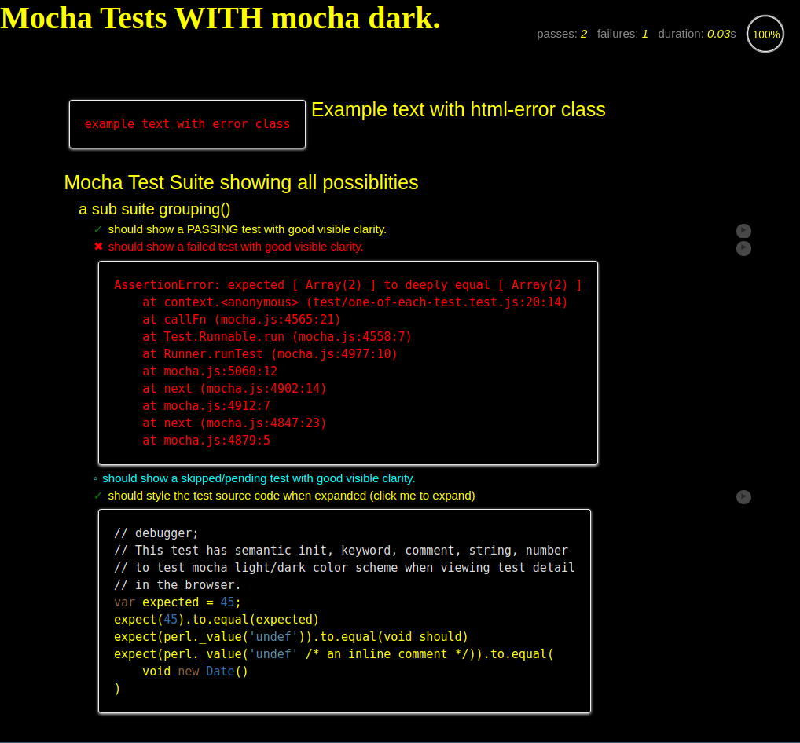
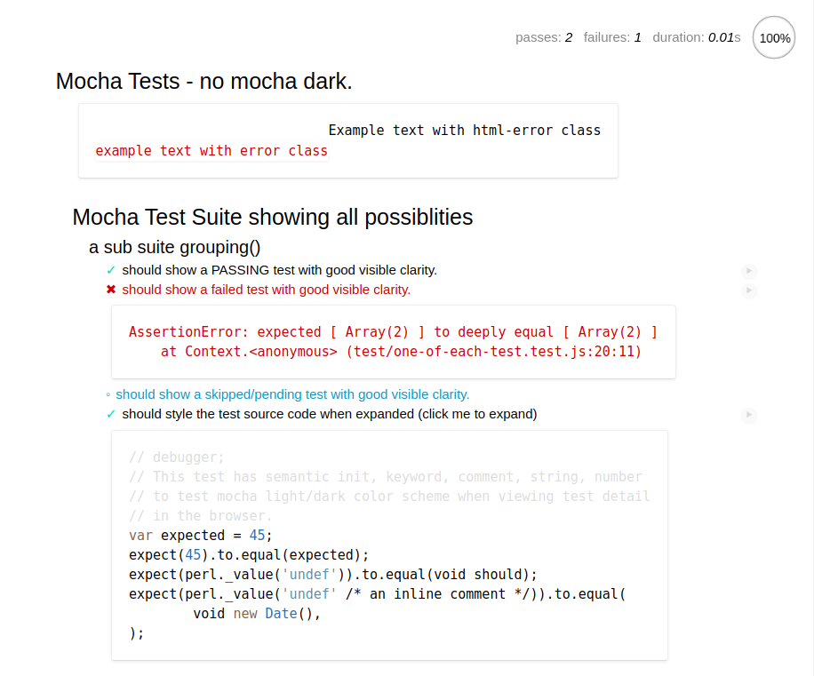

# mocha-dark
A dark color scheme for [Mocha](https://www.npmjs.com/package/mocha), the Simple, flexible, fun JavaScript test framework for Node.js &amp; The Browser.

## Motivation

To provide a dark color scheme for the browser based [Mocha](https://www.npmjs.com/package/mocha) test runner.
For accessibility, for those who have visual difficulties or for those who just prefer a dark color theme when viewing their test results.

## Features

In this release (version: 2.2.5) we simply provide a replacement for `mocha.css` and `mocha.js` with a dark color scheme for use in Mocha browser based tests.

## Usage

After installing *mocha-dark* you simply need to replace `mocha/mocha.css` with `mocha-dark/mocha.css` within any `*.html` testing files in your project.

And `mocha/mocha.js` with `mocha-dark/mocha.js` within any `*.html` testing files or any `*.js` files you use to import `mocha.js` in your project.

This could be simply accomplished with a single command:

```sh
perl -i -pne 's{mocha/mocha\.(css|js)}{mocha-dark/mocha.$1}g' test/*.html
```

And changed back to light mode with the reverse command:
```sh
perl -i -pne 's{mocha-dark/mocha\.(css|js)}{mocha/mocha.$1}g' test/*.html
```

or with your git source control if you haven't changed the tests in any other way:

```sh
git checkout -- test/*.html
```

To automate this process when you run your tests you can add an additional target to your `package.json`

```javascript
// in package.json:
"scripts": {
  "test": "mocha ...",
  "pretest:dark": "perl -i -pne 's{mocha/mocha\\.(css|js)}{mocha-dark/mocha.$1}g' test/*.html",
  "test:dark": "npm test"
}
```

Then you run the dark tests with:

```sh
npm run test:dark
```

## Color Scheme Differences

### Mocha Dark Theme

### Mocha Default Theme



## Release History
