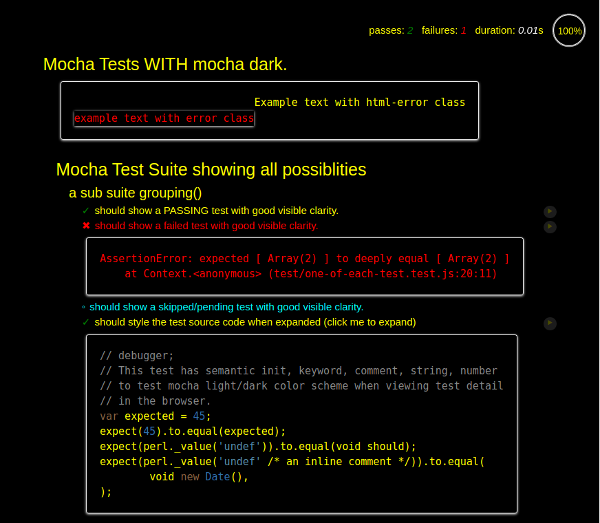

#  mocha-dark version: 2.3.4

☕️ A dark color scheme for [Mocha](https://www.npmjs.com/package/mocha), the Simple, flexible, fun JavaScript test framework for Node.js &amp; The Browser. ☕️

## Motivation

To provide a dark color scheme for the browser based [Mocha](https://www.npmjs.com/package/mocha) test runner.
For accessibility, for those who have visual difficulties or for those who just prefer a dark color theme when viewing their test results.

## Features

In this release (version: 2.3.4) we provide a replacement for `mocha.css` and `mocha.js` with a dark color scheme for use in Mocha browser based tests.
* Contains both default (light) and dark scheme.
* It detects the CSS media query prefers-color-scheme setting if your Operating System sets it and there is no override.
* The user can make the page render dark on startup.
* The user can click to toggle the scheme and have the setting remembered.
* Color scheme setting is remembered for `file://` protocol as well as web server pages.

## Issues
* The circular progress indicator does not update color scheme until the page is reloaded.

## Usage

After installing *mocha-dark* you need to replace `mocha/mocha.css` with `mocha-dark/mocha.css` within any `*.html` testing files in your project.

And `mocha/mocha.js` with `mocha-dark/mocha.js` within any `*.html` testing files or any `*.js` files you use to import `mocha.js` in your project.

This could be simply accomplished with a single command:

```sh
perl -i -pne 's{mocha/mocha\.(css|js)}{mocha-dark/mocha.$1}g' test/*.html
```

Then you can set the dark scheme on startup by adding a `class="mocha-dark"` to the *body* element of your `*.html` pages.

Again a single command can do that:

```sh
perl -i -pne 's{<body>}{<body class="mocha-dark">}g' test/*.html
```

It is then simpler to switch back to the default scheme:

```sh
perl -i -pne 's{"mocha-dark"}{"mocha-light"}g' test/*.html
```

To automate this process when you run your tests you can add an additional target to your `package.json`

```javascript
// in package.json:
"scripts": {
  "test": "mocha ...",
  "pretest:light": "perl -i -pne 's{\"mocha-dark\"}{\"mocha-light\"}g' test/*.html",
  "test:light": "npm test"
  "pretest:dark": "perl -i -pne 's{\"mocha-light\"}{\"mocha-dark\"}g' test/*.html",
  "test:dark": "npm test"
}
```

Then you run the dark tests with:

```sh
npm run test:dark
```

And back to the light tests with:

```sh
npm run test:light
```

## Changing Scheme in the Browser

Once you are viewing the tests in the browser you can toggle the color scheme by clicking on the circular progress indicator at top right of the page.

The currently clicked setting is remembered using browser `localStorage` so it will persist forever and work on pages loaded from `file://` or loaded from web servers.

Alternatively, you can toggle the color scheme using a command in the *Javascript* console:

```javascript
mocha.setColorScheme('mocha-dark') // or mocha-light
```
ss
## Color Scheme Differences

### Mocha Dark Theme


### Mocha Default Theme


## Release History
* 2.2.5 initial package matching an old version of mocha and providing only the dark scheme.
* 2.3.4 to match Mocha release with both light/dark CSS and mocha-dark class on body element and cookie setting to remember change to chosen scheme.
